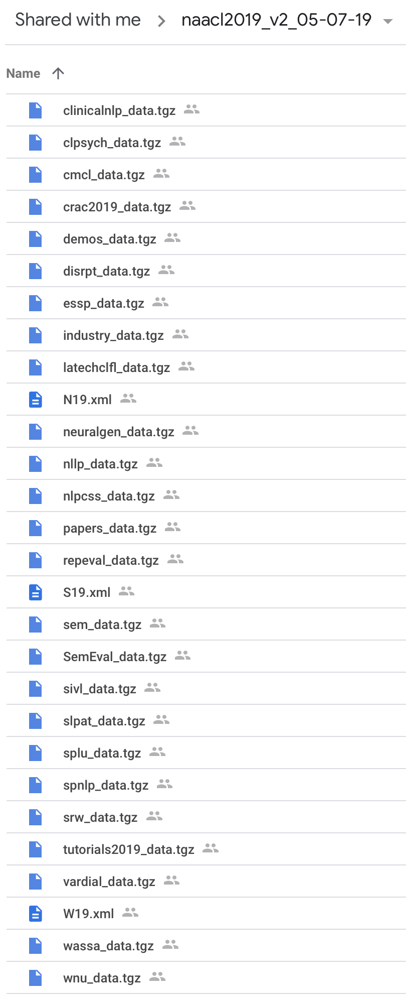

# NAACL-HLT 2019 Schedule Data & Scripts

This repository contains the data files and processing scripts that are used to prepare the data used to populate the schedules in both the NAACL 2019 official website as well as the official Whova app.

This is a separate repository since it makes it much easier to use it as a git submodule in both the [website](https://github.com/naacl-org/naacl-hlt-2019) as well as the [app](https://github.com/naacl-org/naacl-app-2019) repositories. This will allow syncing any changes in the data files much easier.

## Contents

The contents of this repository live under two main directories: `scripts` and `data`. The `data` directory contains the processed files that are needed to produce the schedules and the `scripts` directory contains the scripts to produce those files and also parse/read those files. The latter scripts are meant for use in the website/app repositories.

## Setting Up

In order to run the scripts in this repository, you first need to create a [conda](https://conda.io/en/latest/) environment. First you should [install miniconda](https://conda.io/en/latest/miniconda.html). Once you have it installed, run the following to create the Python environment:

```bash
conda create -n naacl2019 -c conda-forge --file requirements.txt
```

This will create a conda environment called `naacl2019` which you will need to "activate" before running any of the scripts. To activate this environment, run:

```bash
conda activate naacl2019
```

## Producing Schedule Data

Although most of the process for producing the data files needed for the schedule is automated, there is a manual part as well.

### Automated Extraction

The automated extraction uses `scripts/extract_data.py`. This script extracts the relevant files from the data files that are provided by the NAACL 2019 pub chairs. The pub chairs provided a directory on Google Drive containing the following files:



Assuming that directory has been downloaded to a path contained in the environment variable `$INPUTDIR`, this script should be run as follows:

```
python scripts/extract_data.py $INPUTDIR data
```

This will create a `data` directory at the same level as the `scripts` directory. This directory will contain three sub-directories: `xml`, `order`, `mapping`. These sub-directories contain the following files:

- `xml` : `{N19,W19,S19}.xml`, the XML files containing the author metadata, abstract, and anthology links for all papers being presented at the conference, workshops, and other co-located events. 
- `order` : `<session>_order`, where `<session>` is the name of the various tracks, workshops, and co-located events. For example, `papers_order` is the order file for the main track papers, `industry_order` is the order file for the industry track papers, `cmcl_order` is the order file for the CMCL workshop, etc. 
- `mapping` : `<session>_id_map.txt`, where `<session>` is the name of the various tracks, workshops, and co-located events. Each such file contains the mapping between the ACL Anthology IDs and the START IDs for the papers. This mapping is necessary to be able to make a bridge between the paper times (contained in the order files) and the paper metadata (contained in the XML files above).

### Main Conference Order File

It is simpler to have a single order file representing the entirety of the main conference including main track papers, industry track papers, demo papers, and SRW papers. Since such a file was not provided for NAACL 2019, I had to manually create it. To do so, I did the following:

- Take the order file provided by the program chairs. Technically, we should be using the extracted file `data/order/papers_order`. However, this file does not contain the themes for the poster sessions. Therefore, we need to start with the order file provided by the PCs which does contain this information. Let's denote this file as M.

- For each of the extracted files `data/order/industry_order`, `data/order/demos_order`, and `data/order/srw_order`, manually take each paper entry in that order file and add it to M in the right time slot. Since the START IDs for the various components of the main conference are usuall independent, add a suffix, e.g. `-demo`, `-srw`, `industry`, etc., after the paper ID to prevent any accidental overlaps.

This combined order file was then saved as `data/order/manually_combined_order`. This file now supersedes `data/order/papers_order`, `data/order/industry_order`, `data/order/demos_order`, and `data/order/srw_order`. Any changes needed should be made directly to this file.
[pub_chair_files.png]: 
