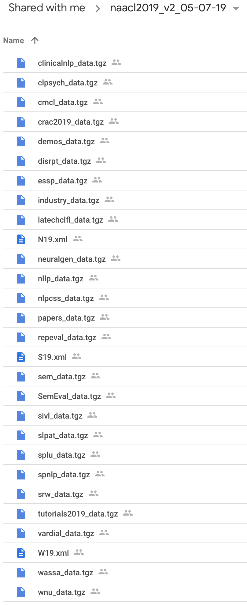

# NAACL-HLT 2019 Schedule Data & Code

This repository contains the data files and processing code that are used to prepare the data used to populate the schedules in both the NAACL 2019 official website as well as the official Whova app.

This is a separate repository since it makes it much easier to use it as a git submodule in both the [website](https://github.com/naacl-org/naacl-hlt-2019) as well as the [app](https://github.com/naacl-org/naacl-app-2019) repositories. This will allow syncing any changes in the data files much easier.

## Contents

The contents of this repository live under two main directories: `code` and `data`. The `data` directory contains the processed files that are needed to produce the schedules and the `code` directory contains code to produce those files and also parse/read those files. Some of this code is meant for use in the website/app repositories that will use this repository as a submodule.

## Setting Up

In order to run the code in this repository, you first need to create a [conda](https://conda.io/en/latest/) environment. First you should [install miniconda](https://conda.io/en/latest/miniconda.html). Once you have it installed, run the following to create the Python environment:

```bash
conda create -n naacl2019 -c conda-forge --file requirements.txt
```

This will create a conda environment called `naacl2019` which you will need to "activate" before running any of the code. To activate this environment, run:

```bash
conda activate naacl2019
```

## Producing Schedule Data

Although most of the process for producing the data files needed for the schedule is automated, there is a manual part as well.

### Automated Extraction

The automated extraction uses `code/extract_data.py`. This script extracts the relevant files from the data files that are provided by the NAACL 2019 pub chairs. The pub chairs provided a directory on Google Drive containing the following files:



Assuming that directory has been downloaded to a path contained in the environment variable `$INPUTDIR`, this script should be run as follows:

```
python code/extract_data.py $INPUTDIR data
```

This will create a `data` directory at the same level as the `code` directory. This directory will contain three sub-directories: `xml`, `order`, `mapping`. These sub-directories contain the following files:

- `xml` : `{N19,W19,S19}.xml`, the XML files containing the author metadata, abstract, and anthology links for all papers being presented at the conference, workshops, and other co-located events. 
- `order` : `<session>_order`, where `<session>` is the name of the various tracks, workshops, and co-located events. For example, `papers_order` is the order file for the main track papers, `industry_order` is the order file for the industry track papers, `cmcl_order` is the order file for the CMCL workshop, etc. 
- `mapping` : `<session>_id_map.txt`, where `<session>` is the name of the various tracks, workshops, and co-located events. Each such file contains the mapping between the ACL Anthology IDs and the START IDs for the papers. This mapping is necessary to be able to make a bridge between the paper times (contained in the order files) and the paper metadata (contained in the XML files above).

### Manual Steps

The following manual steps are also required.

#### 1. Combined Order File

It is simpler to have a single order file representing the entirety of the main conference including main track papers, industry track papers, demo papers, and SRW papers. Since such a file was not provided for NAACL 2019, I had to manually create it. To do so, I did the following:

- Take the order file provided by the program chairs. Technically, we should be using the extracted file `data/order/papers_order`. However, this file does not contain the themes for the poster sessions. Therefore, we need to start with the order file provided by the PCs which does contain this information. Let's denote this file as M.

- For each of the extracted files `data/order/industry_order`, `data/order/demos_order`, `data/order/tutorials2019_order`, and `data/order/srw_order`, manually take each paper entry in that order file and add it to M in the right time slot. Since the START IDs for the various components of the main conference are usuall independent, add a suffix, e.g. `-demos`, `-srw`, `industry`, `-tutorial`, etc., after the paper ID to prevent any accidental overlaps. Note that TACL paper IDs should have a `-tacl` suffix. 

This combined order file was then saved as `data/order/manually_combined_order`. This file now supersedes `data/order/papers_order`, `data/order/industry_order`, `data/order/demos_order`, `data/order/tutorials2019_order`, and `data/order/srw_order`. Any changes needed subsequent to this should be made directly to this file.


#### 2. Combined Mapping File

It's also equally convenient to have a single `id_map.txt` file for the entire main conference event. To do this, we start with `data/mapping/papers_id_map.txt` and the manually add in the entries from `data/mapping/industry_id_map.txt`, `data/mapping/demos_id_map.txt`, `data/mapping/tutorials2019_id_map.txt`, and `data/mapping/srw_id_map.txt`. You will need to modify the START IDs from each mapping file to have the same suffixes as in the previous section (e.g., `-demos` for the demo IDs, etc.) so as to make lookup easier.

#### 3. Non-anthology Metadata File

For most of the items in the schedule, the titles and authors are supposed to be provided by the `N19.XML` file which is the file used by the ACL anthology. However, there are instances when the anthology does not contain all of the items in the schedule. One example is TACL papers that have been chosen by their authors to be presented at the conference. Such papers may not show in the anthology on time and, therefore, their titles and authors may not be included in the XML file. Another example is non-archival papers for the student research workshop (SRW). They may be included as posters in the schedule but their metadata is, again, not included in the XML file since they are non-arhival. 

To handle such cases where the anthology XML file may not have the metadata we need, we need to manually create a file that does. This file should be created by the program chairs and should be a tab-separated file with the following fields: paper IDs, titles, and authors. The IDs should be the same as they are in the manually combined order file above, i.e., TACL paper IDs should have the `-tacl` suffix, SRW ones should have the `-srw` suffix, etc.

For NAACL 2019, this file is located at `data/non-anthology-metadata.tsv`. Any changes to the titles and authors for these papers should be made directly to this file.

#### 4. Info for Plenary Sessions

We may also want to display a blurb/abstract and other info for plenary sessions on the website and in the app, e.g., keynote sessions, panels, business meetings etc. For this, we create another TSV file with four fields: "session", "abstract", "people", and "people_url". The `session` field contains a part of the name of the session (enough to locate it programmatically), the `abstract` field contains the blurb, the `person` field contains the name of the person associated with the plenary session, if any and the `person_url` contains the URL to that person's website, if any. The `person` and `person_url` fields are mainly for keynotes. 

We do not use this file in any code in this repository but simply provide it to the app and website repositories that will use this repository as a submodule. This file is located at `data/plenary-info.tsv`.

### Parsing the Order File

**IMPORTANT**: Every single item in the order file being parsed must be in chronological order for the parsing below to work. This should not be an issue since the name "order file" indicates that this assumption is already being met.

The module `code/orderfile.py` is an object-oriented parser for \*ACL-style conference order files. It parses the order file to create an `Agenda` object which is a collection of `Day` objects which in turn contain either `Session` or `SessionGroup` objects. `Session` objects are used to represent conference session where as `SessionGroup` objects are used for a group of parallel track sessions. Therefore, a `SessionGroup` object also contains `Session` objects. Each `Session` object also contains `Item` objects which refer to presentation items (papers/posters/tutorials). 

This module is meant to be used with a complete order file, e.g., the manually combined order file described abovee and contained in `data/order/manually_combined_order`. A Python session illustrating the use of this module is shown below:

```python
from pprint import pprint
from orderfile import Agenda
agenda = Agenda()
agenda.fromfile('../data/order/manually_combined_order')

# look at the days in agenda
print('Days in agenda:')
pprint(agenda.days)
print()

# look at the contents of day 2
print('Day 2 contents:')
pprint(agenda.days[1].contents)
print()

# look at the items in a session in a session group on day 4
print('Items in a session in a session group:')
pprint(agenda.days[3].contents[2].sessions[0].items)
print()
```

The output of the above commands is as follows:

```
Days in agenda:
[Day <Sunday, June 02, 2019>,
 Day <Monday, June 03, 2019>,
 Day <Tuesday, June 04, 2019>,
 Day <Wednesday, June 05, 2019>]

Day 2 contents:
[Session 9:00--9:30 <type=plenary, title=Land Acknowledgments, Opening Remarks and Janyce Weibe and Richard Kittredge Remembrances, room=Nicollet Grand Ballroom>,
 Session 9:30--10:30 <type=plenary, title=Keynote 1: Arvind Narayanan "Data as a Mirror of Society: Lessons from the Emerging Science of Fairness in Machine Learning", room=Nicollet Grand Ballroom>,
 Session 10:30--11:00 <type=break, title=Coffee Break>,
 SessionGroup 11:00--12:30 <Oral Sessions (long papers) and Posters (long and short papers)>,
 Session 12:30--13:00 <type=break, title=Grab your lunch break>,
 Session 13:00--14:30 <type=plenary, title=Careers in NLP Panel, room=Nicollet Grand Ballroom, chair=Philip Resnik>,
 Session 14:30--15:00 <type=break, title=Coffee Break>,
 SessionGroup 15:00--16:30 <Oral sessions (short papers), Posters (long and short papers), and Demos>,
 Session 16:30--17:00 <type=break, title=Coffee Break>,
 SessionGroup 17:00--18:30 <Oral sessions (long papers)  and Posters (long and short papers)>]

Items in a session in a session group:
[Paper <id=734, track=main>,
 Paper <id=1626, track=main>,
 Paper <id=1770, track=main>,
 Paper <id=2300, track=main>,
 Paper <id=2480, track=main>]
```

For more details on how this module works, run `import orderfile; help(orderfile)` at a Python prompt and examine the comprehensive comments
in the source code. One important thing to note is that since the order file
is already in chronological order, we don't really need to do much sorting
in the code. We can simply iterate over `Agenda.days` and then iterate over `Day.contents` since things will already in chronological order. Even the session groups contain the parallel tracks in the right order. 

### Obtaining Metadata

The order files (including the manually combined one) are not supposed to contain paper titles, authors, abstracts, and anthology URLs which is metadata
that we need for the website and the app. Therefore, to get this metadata,
we usually rely on the anthology XML files extracted above: (`N19.xml` for the main conference, `W19.xml` for the workshops and `S19.xml` for the co-located \*SEM conference). 

However, these anthology files use entirely different IDs
that have nothing to do with the IDs that are in the order files (which come from START). Therefore, we need to use the mapping files extracted above (`*_id_map.txt`) and particularly the manually combined ID mapping file to create a bridge between the order file IDs and the anthology metadata.

It may not always be the case that the anthology contains all of the metadata we need. See the section on "Non-anthology Metadata File" above. Therefore, we need to be able to use both the XML files and this non-anthology TSV file.

The module `code/metadata.py` can be used to obtain the metadata needed
for order file entries. This module takes XML files, mapping files, as well
as non-anthology metadata TSV files as input and returns an instance of a
`ScheduleMetadata` object which can then be used to look up metadata for any
given paper either through its order file ID or even through its anthology
ID. A Python session illustrating the use of this module is shown below:

```python
from metadata import ScheduleMetadata

# create a ScheduleMetadata object
sm = ScheduleMetadata.fromfiles(xmls=['../data/xml/N19.xml'], mappings=['../data/mapping/manually_combined_id_map.txt'], non_anthology_tsv='../data/non-anthology-metadata.tsv')

# look up metadata via order file ID
sm['7-tutorial']

# look up metadat via anthology ID
sm['N19-5002']
```

The above session returns the following output:

```                  
MetadataTuple(title='Deep Learning for Natural Language Inference', authors='Samuel Bowman and Xiaodan Zhu', abstract='This tutorial discusses cutting-edge research on NLI, including recent advance on dataset development, cutting-edge deep learning models, and highlights from recent research on using NLI to understand capabilities and limits of deep learning models for language understanding and reasoning.', anthology_url='http://www.aclweb.org/anthology/N19-5002')

MetadataTuple(title='Deep Learning for Natural Language Inference', authors='Samuel Bowman and Xiaodan Zhu', abstract='This tutorial discusses cutting-edge research on NLI, including recent advance on dataset development, cutting-edge deep learning models, and highlights from recent research on using NLI to understand capabilities and limits of deep learning models for language understanding and reasoning.', anthology_url='http://www.aclweb.org/anthology/N19-5002')
```
